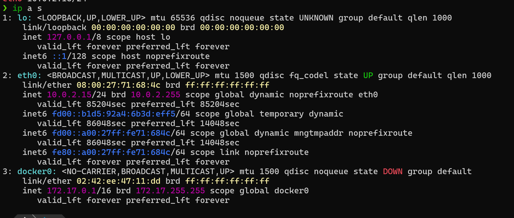
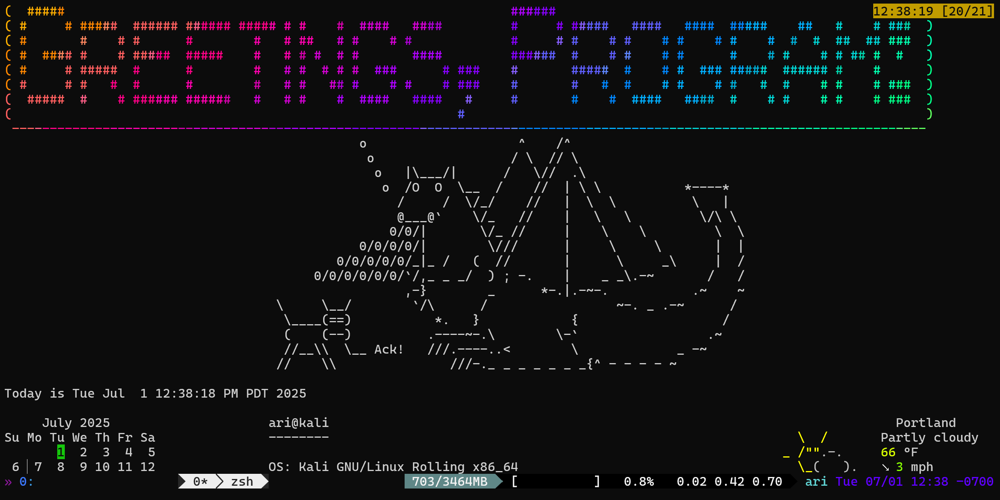

# HW 1

## Instructions

1. Create a private GitLab repo called netsec-Su25-<CECS> (replace <CECS> with your actual MCECS username) and clone it to your local machine. You will be using this repo for the rest of the term. This repo exists on the CECS intranet, and uses your CECS credentials for authentication.

2. Add dmcgrath (developer or higher) of your repo. This will allow me to view your repo and provide feedback.

3. Create a folder within the repo called hw1. This is where you will add documentation regarding this assignment.

4. Now that you have your repo set up, we’ll be turning to the workstation. I would suggest you document everything you did in a markdown file in your repo called hw1.md. And by suggest I mean require. I’m just being nice about it.

5. Use your VM is up and running, run the command ip a s and take a screenshot of the output. Add this to your repo and include it in your hw1.md file.

6. Follow the instructions on the Kali configuration page to configure the Kali workstation. Document this in your hw1.md file.

### Notes on Kali Config:

- configured kali with 

> $ sudo kali-tweaks

- set network respositories settings:
    - Mirrors set to Cloudfare
    - Protocol set to HTTPS
- updated linux packages with 

> $ sudo apt upgrade -y 

and used -y to confirm any updates without confirmation
- Then used curl to download the script to install all the useful tools we will use in this class
- uncommented github related lines and filled in my information
- used the command
> $ chmod +x ./setup.sh

to the allow the script to run and ran it to get the successful output as seen below

7. Include a screenshot of the workstation showing the successful output of the setup.sh script from the Kali configuration page. This should be after a reboot of the VM. Your shell should look something like this:

